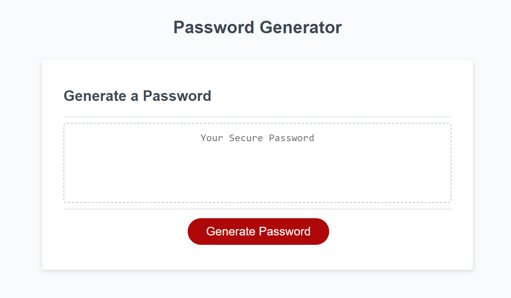

# Password Generator

## Description

Password generator that can be edited to contain 8-128 characters. Generated password can be made to contain upper and lower case letters, numbers, and special characters.

## Table of Contents (Optional)

If your README is long, add a table of contents to make it easy for users to find what they need.

- [Installation](#installation)
- [Usage](#usage)
- [Credits](#credits)
- [License](#license)

## Usage

Click generate password and answer the promps to generate a random password, then copy the value from the page for your own use.

